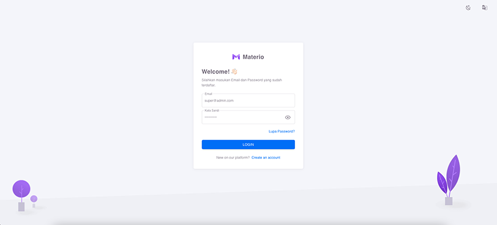
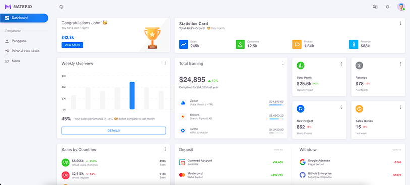
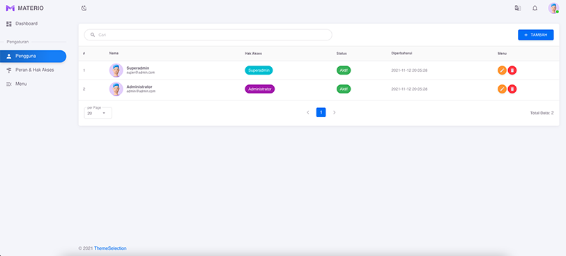

###Laravel Vue SPA (Materio Admin)
****
#### Main Features
- Dynamic menus based on Roles

### Depedencies
**Backend**
- Laravel 8
- JWT Auth
- Spatie Roles & Permission
- UUID

**Frontend**
- [Vuejs Materio Admin Template](https://github.com/themeselection/materio-vuetify-vuejs-admin-template-free)
- vuex store
- vue-i18n _(default locale is ID-Bahasa)_
- Vee Validation
____
#### How to Start
#### *Development*
```js//Install all packages
$ copy .env.example -> .env
$ composer install
$ yarn install //recomended using yarn package manager
$ php artisan key:gen
$ php artisan jwt:secret
$ php artisan migrate --seed
$ yarn serve //running backend and frontend with hot reload
```

#### *Production*
```
yarn prod
```

To test the production build, change the `.env` file as follows and refresh the page.
```env
APP_ENV=production
```
____
#### Login
```
/// superadmin
username: superadmin
password: pass@word1

/// Administrator
username: administrator
password: pass@word1
```




